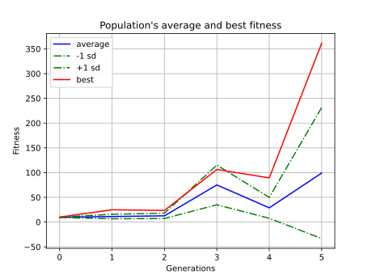
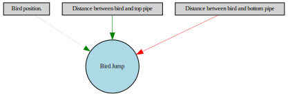

<h1 align="center">
  
</h1>
<h2 align="center">AI Plays Flappy Bird </h2>

  <p align="center">
    An AI that plays self made flappy bird game using NeuroEvolution of Augmenting Topologies (NEAT)
    <br />
    <br />
    <a href="https://github.com/BeholdenArt/pyF1-2019/issues">Report Bug</a>
    ·
    <a href="https://github.com/BeholdenArt/pyF1-2019/issues">Request Feature</a>
  </p>
</p>


<!-- TABLE OF CONTENTS -->
<br />
<details open="open">
  <summary><h2 style="display: inline-block">TABLE OF CONTENTS</h2></summary>
  <ol>
    <li>
      <a href="#ABOUT-THE-PROJECT">ABOUT THE PROJECT</a>
      <ul>
        <li><a href="#Demo">Demo</a></li>
        <li><a href="#Built-with">Built With</a></li>
      </ul>
    </li>
      <a href="#GETTING-STARTED">GETTING STARTED</a>
      <ul>
        <li><a href="#Prerequisite">Prerequisite</a></li>
        <li><a href="#Installation">Installation</a></li>
      </ul>
    </li>
    <li><a href="#USAGE">USAGE</a></li>
    <li><a href="#CONTRIBUTION">CONTRIBUTION</a></li>
    <li><a href="#CONTACT-ME">CONTACT ME</a></li>
  </ol>
</details>


<br><br><br>
<!-- ABOUT THE PROJECT -->
## ABOUT THE PROJECT

<p align="center">
  <a href="https://github.com/BeholdenArt/Python-plays-Flappy-Bird">
      <h3>  GIF of AI playing Flappy Bird after training. </h3>
    
  </a>
</p>
<br />

<p align="left">
  <h3> Average Fitness per generation </h3>
  <a href="https://github.com/BeholdenArt/Python-plays-Flappy-Bird">
    
  </a>
   <h3> Neural Network model </h3>
  <a href="https://github.com/BeholdenArt/Python-plays-Flappy-Bird">
    
  </a>
</p>
<br>


## Demo 


https://user-images.githubusercontent.com/50458157/132477125-4097f1de-4da2-43d6-99a8-a28485bb6c22.mp4


<!-- BUILT WITH -->
## Built-with
<ol>
  <li> <a href="https://neat-python.readthedocs.io/en/latest/index.html" target="_blank">NeuroEvolution of Augmenting Topologies (NEAT)</a> - Brain of the AI. </li> 
  <li> <a href="https://graphviz.org/documentation/" target="_blank">Graphviz</a> - To plot the network. </li> 
  <li> <a href="https://matplotlib.org/stable/contents.html" target="_blank">Matplotlib</a> - Used with graphviz to plot the network </li>
  <li> <a href="https://www.pygame.org/docs/" target="_blank">Pygame</a> - To make the game.</li>
</ol>
  <br>


<br><br><br>
<!-- GETTING STARTED -->
## GETTING STARTED

<!-- PREREQUISITE -->
## Prerequisite 
<p align="left" > 
    &emsp;
   <a href="https://www.python.org" target="_blank">
    
  </a>
  &emsp; 
    <a href="https://jupyter.org/install"></a>
  &emsp;
  </a>
  <a href="https://www.tensorflow.org/"></a>
  &emsp;
  </a>
</p>

<br>


<!--INSTALLATION -->
## Installation
<ol>
  <li> Clone the repo </li>
  
   ```sh
   git clone https://github.com/BeholdenArt/Python-plays-Flappy-Bird.git
   ```
  
  <li> Install requirements </li>
  <p>Install (the latest) <a href="https://developer.nvidia.com/cuda-downloads" alt="nvidia cuda toolkit">Graphviz</a> and add Graphviz/bin into PATH variable (to plot the graph)</p>
   
  ```sh
   pip3 install -r requirements.txt
   ```
  
</ol>


<br><br><br>
<!-- USAGE -->
## USAGE

To use this project.
*  Complete the getting started part. </li>
*  To change configuration of NEAT
    ```
    Edit config-feedforward.txt
    ```
*  To run the AI </li>
    ```
    python AI.py
    ```

*  To play the game by yourself </li>
    ```
    python PlayGame.py
    ```


<br><br><br>
<!-- CONTRIBUTING -->
## CONTRIBUTION
Please refer to each project's style and contribution guidelines for submitting patches and additions. In general, we follow the "fork-and-pull" Git workflow.

 1. **Fork** the repo on GitHub
 2. **Clone** the project to your own machine
 3. **Commit** changes to your own branch
 4. **Push** your work back up to your fork
 5. Submit a **Pull request** so that we can review your changes

NOTE: Be sure to merge the latest from "upstream" before making a pull request!


<br><br><br>
## CONTACT ME

<p align="center">
	<a href="mailto:priyanshub5645@gmail.com"></a>
	<a href="https://github.com/BeholdenArt"></a>
	<a href="https://linkedin.com/in/priyanshu-bairwa-827432190"></a>
	<a href="https://www.facebook.com/priyanshu.bairwa.129794"></a>
	<a href="https://instagram.com/theblockedguy"></a>
	
</p>
